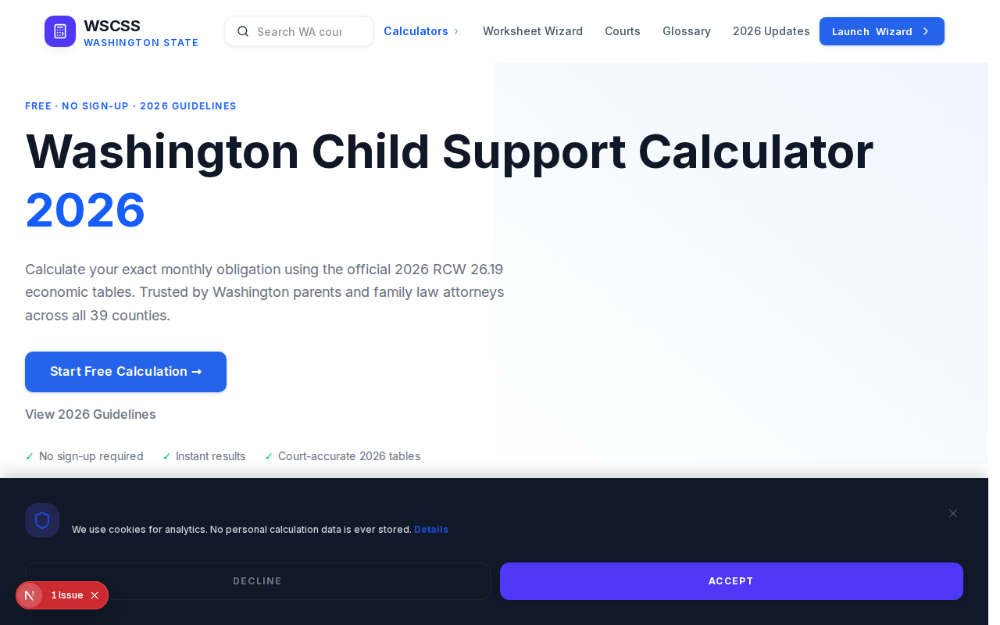
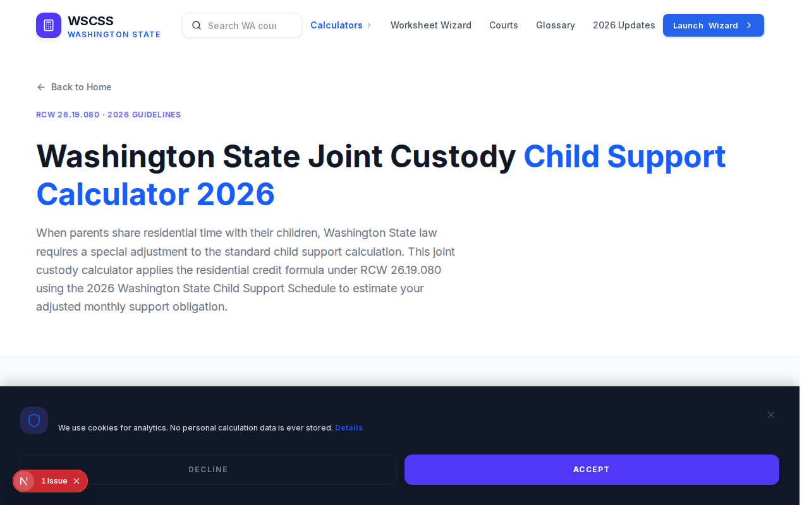
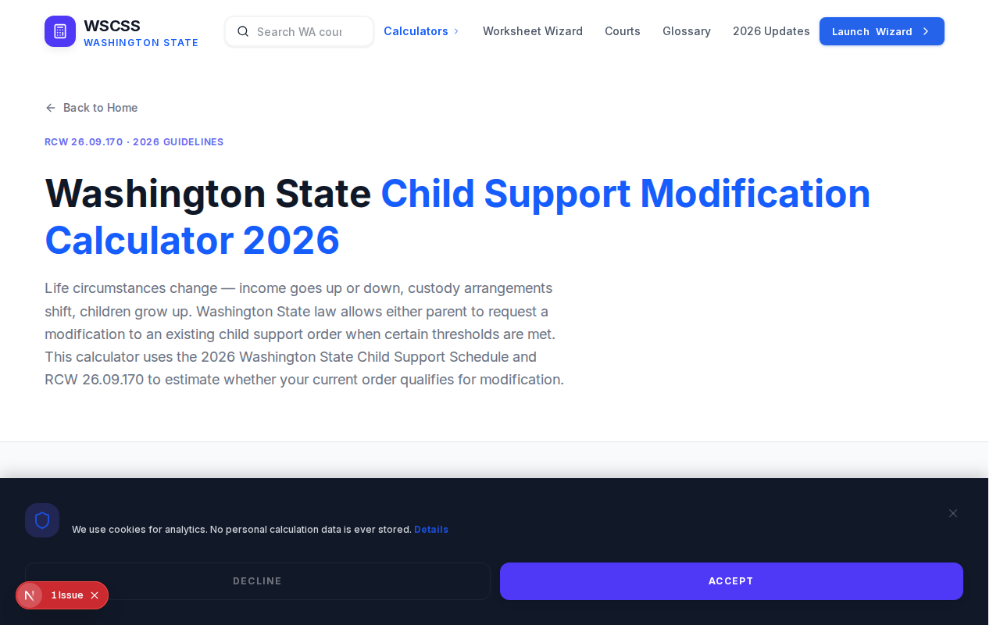

# Washington Child Support Calculator 🚀

[](https://wscss.site)
[](https://nextjs.org)
[](https://vercel.com)

## 📖 Table of Contents
- [Description](#description)
- [Live Demo](#live-demo)
- [Screenshots](#screenshots)
- [Features](#features)
- [Tech Stack](#tech-stack)
- [Getting Started](#getting-started)
- [Project Structure](#project-structure)
- [Deployment](#deployment)
- [Developer](#developer)
- [License](#license)

## 📝 Description
The Washington Child Support Calculator is a professional-grade tool designed for parents, attorneys, and legal professionals to estimate child support obligations with precision. It is fully updated for the 2026 Washington State legislative changes (HB 1014) and uses the official AOC economic tables to solve the complexity of manual worksheet calculations.

## 🔗 Live Demo
Visit the live application at: [https://wscss.site](https://wscss.site)
*Calculate your 2026 Washington child support instantly using the official state standards.*

## 📸 Screenshots

### Home Page - 2026 Child Support Calculator


### Joint Custody Calculator


### Modification Calculator


## ✨ Features
- **2026 Legislative Compliance**: Fully updated for House Bill 1014 and the latest Washington State AOC economic tables.
- **Automated SSR Logic**: Intelligent processing of the Self-Support Reserve (SSR) to protect low-income payers automatically.
- **Interactive Worksheets**: Real-time calculation updates as you type with a transparent, step-by-step math breakdown.
- **Professional PDF Export**: Generate and download court-ready child support worksheets instantly from your browser.
- **Multi-Calculator Suite**: Specialized tools for Joint Custody, Deviations, and Modification requests.
- **Advanced Tax Estimator**: Built-in conversion from gross to net income optimized for Washington state payroll standards.
- **SEO-First Architecture**: High-performance scores and deep-linked resources for all 39 Washington counties.
- **Responsive Glassmorphism UI**: A modern, mobile-friendly design built for a seamless user experience across all devices.

## 🛠️ Tech Stack
| Technology | Purpose |
| :--- | :--- |
| **Next.js 16** | Core framework providing Server-Side Rendering (SSR) and App Router architecture for optimal performance. |
| **React 19** | Modern UI library for building dynamic and interactive user interfaces. |
| **Tailwind CSS 4** | Next-generation utility-first CSS framework for fast, responsive, and maintainable styling. |
| **Framer Motion** | High-performance animation library for smooth UI transitions and interactive elements. |
| **TypeScript** | Enhances developer productivity and code reliability with static type checking. |
| **Lucide React** | A clean and consistent set of icons for a professional visual language. |
| **jsPDF & html2canvas** | Client-side libraries for generating high-quality PDF worksheets directly from the browser. |

## 🚀 Getting Started

### Prerequisites
- Node.js 18+
- npm or yarn
- Git

### Installation Steps
1. **Clone the repository:**
   ```bash
   git clone https://github.com/saad461/washington.git
   ```
2. **Navigate into the folder:**
   ```bash
   cd washington
   ```
3. **Install dependencies:**
   ```bash
   npm install
   ```
4. **Run the development server:**
   ```bash
   npm run dev
   ```

## 📂 Project Structure
```text
washington/
├── app/            # App router, pages, and layouts
├── components/     # Reusable React components
├── data/           # Static data and economic tables
├── lib/            # Business logic and utility functions
├── public/         # Static assets (images, icons)
├── scripts/        # Build and automation scripts
└── utils/          # Calculation engine and SEO helpers
```

## ☁️ Deployment
The project is optimized for deployment on the **Vercel** platform:
1. Push your code to a GitHub repository.
2. Connect your GitHub account to [Vercel](https://vercel.com).
3. Import the repository and click **Deploy**.
4. Vercel will automatically handle the build and provide a live URL.

## 👨‍💻 Developer
- **Name**: Saad Nadeem
- **Email**: [saadnadeem157@gmail.com](mailto:saadnadeem157@gmail.com)
- **GitHub**: [@saad461](https://github.com/saad461)
- **Portfolio**: [portfolio-saaad.vercel.app](https://portfolio-saaad.vercel.app/)

## 📄 License
This project is licensed under the **MIT License**.
